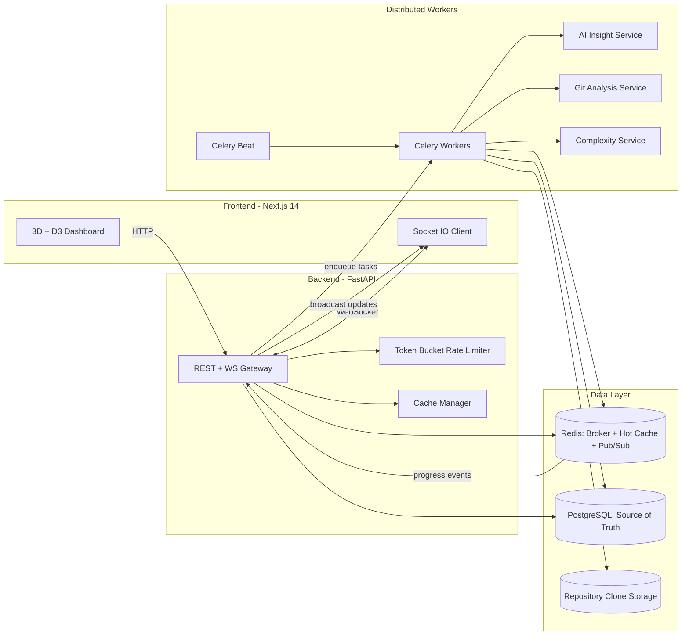

# CodeVoyage Architecture Diagram

## System Context

## Container Topology (Local Docker)

- `frontend`: Next.js 14 app on `:3000`
- `api`: FastAPI + Socket.IO on `:8000`
- `celery-worker`: distributed analysis workers
- `celery-beat`: scheduled orchestration
- `flower`: Celery dashboard on `:5555`
- `postgres`: primary relational store on `:5432`
- `redis`: broker + cache + pub/sub on `:6379`

## Scaling Notes

- Scale workers locally: `docker compose up -d --scale celery-worker=4`
- For 1M+ commits, shard heavy analysis stages by repository or commit range.
- Keep Redis focused on hot keys and transient events; archive heavy results in PostgreSQL.
